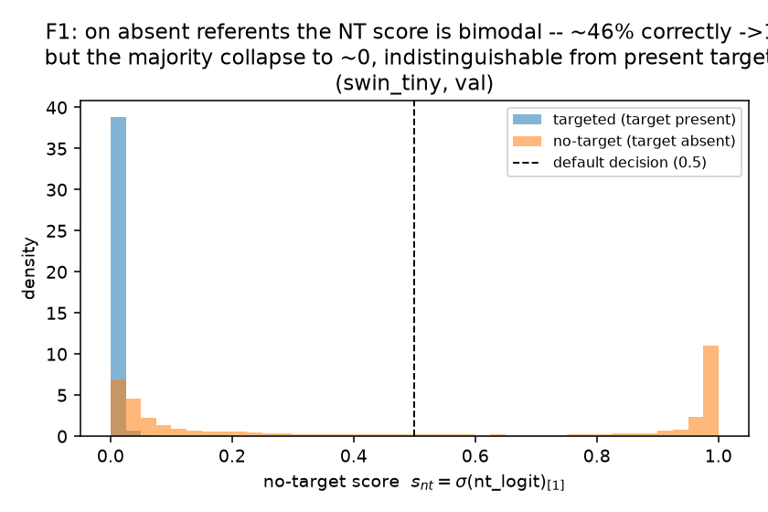
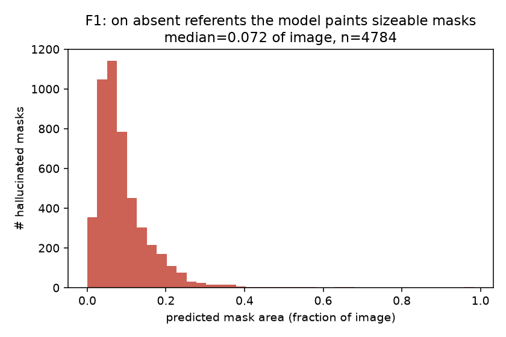
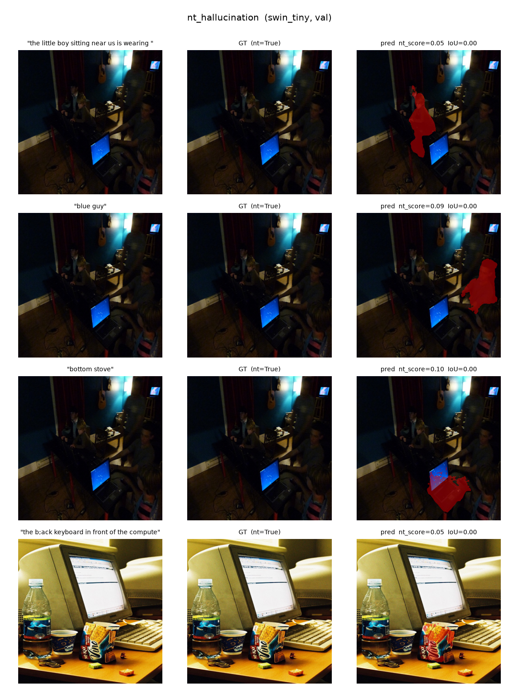
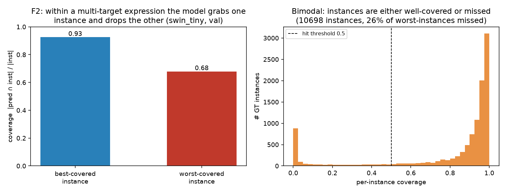
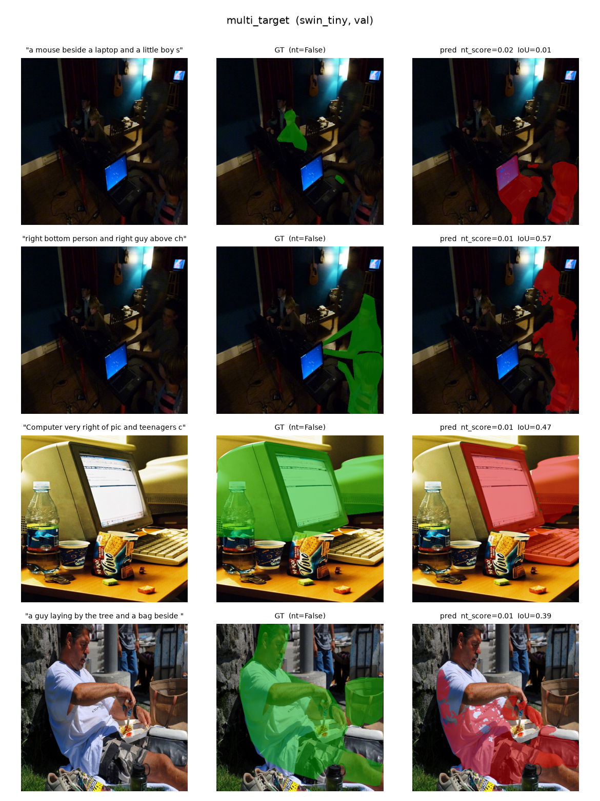
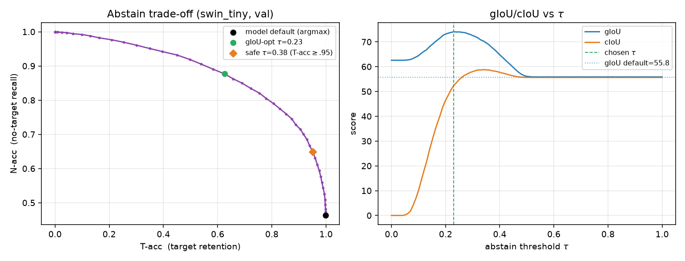

# Visual Media (映像メディア学) — Final Report
### Reproducing ReLA/GRES on gRefCOCO, analysing its failure modes, and adding an abstain-or-clarify detector

> **Language note (for the human):** this report is written in **English** by default. If the
> course requires Japanese, tell the agent / translate before submission.

> **Reproducibility:** every number and figure below is generated by the scripts in this repo
> (`scripts/`, results in `results/`). Nothing is hand-typed. Repo URL: **TODO — fill in.**

---

## 1. Identity block  *(TODO — to be completed by the author; the AI must not invent these)*
- **Name:** TODO
- **Student ID:** TODO
- **Department:** TODO
- **Laboratory:** TODO
- **Own research topic:** TODO *(intended framing: Vision-Language-Action / human-robot
  collaboration, object grounding, and ambiguity→clarification & safety in benchmarks —
  this is the conceptual through-line of §6.)*

---

## 2. Summary of the target paper
**GRES: Generalized Referring Expression Segmentation** (Liu, Ding, Jiang, *CVPR 2023
Highlight*; network name **ReLA**) generalises classic Referring Expression Segmentation
(RES). Classic RES assumes **exactly one** target object per expression. GRES relaxes this
to allow:
- **multi-target** expressions ("the two bottles on the left", "everyone except the kid"), and
- **no-target** expressions, whose referent is **absent** from the image.

To support and measure this, the authors release **gRefCOCO** (built on COCO train2014 images,
RefCOCO-style expressions) with train/val/testA/testB splits, and an evaluation protocol with
**gIoU** (mean per-sample IoU; a correctly-predicted no-target sample scores 1), **cIoU**
(cumulative intersection / cumulative union), **N-acc** (no-target recall, = TP/(TP+FN)),
**T-acc** (target retention, = TN/(TN+FP)) and **Pr@{0.7,0.8,0.9}**.

The network, **ReLA**, is built on Mask2Former / Detectron2. It explicitly models
**Region-Image (RIA)** and **Region-Language (RLA)** interactions: the image is divided into
soft regions; each region attends to the language and to image features, and the regions then
attend to one another so the model can reason about *relationships between regions* rather than
classifying one box. A dedicated **no-target (NT) head** predicts whether the referent exists
at all. With these, ReLA reaches state-of-the-art on gRefCOCO and remains competitive on
classic RefCOCO/+/g.

## 3. Understanding of the method
Reading the released code (`gres_model/`), the inference path is:

1. **Backbone** (Swin-T/-B or R50) extracts multi-scale visual features; a **BERT-base** text
   encoder embeds the expression. The backbone is *language-aware* — language features are fed
   in so vision and language are fused early.
2. **MSDeformAttn pixel decoder** (the Mask2Former deformable-attention encoder) builds a
   high-resolution mask feature map and multi-scale features.
3. **ReLA transformer decoder** (`MultiScaleMaskedReferringDecoder`): 100 learnable
   *region queries* iterate through (i) **RIA** cross-attention to image features, (ii) on the
   first layer a full **RLA** language cross-attention gated by a learned `lang_weight`, and
   (iii) region-region self-attention. Two prediction heads matter at test time:
   - a **minimap / mask** branch — `minimap_embed` produces per-region 2-way logits that are
     combined (`einsum`) with region embeddings and the mask feature map to yield a **2-channel
     target mask** `pred_masks`∈ℝ^{2×H×W}; `argmax` over the 2 channels is the binary output.
   - a **no-target head** — `nt_embed` (a small MLP) is applied per region and **averaged over
     all 100 regions** to give a single 2-way **NT logit**; `argmax` decides "no target".
4. **Inference** (`GRES.refer_inference`) simply sigmoids both outputs. The official evaluator
   compares `argmax(ref_seg)` to the merged GT mask and `argmax(nt_label)` to the empty flag.

**Key observation that drives this report.** The two scalars the model already exposes —
`σ(nt_logit)` (a no-target score) and the foreground mask confidence — are exactly the signals
a *safe* agent needs to decide whether to **act, abstain, or ask**. ReLA collapses them with a
hard `argmax` at 0.5 and always commits to either a mask or "empty". §6 keeps the model frozen
and replaces that hard decision with a calibrated abstain-or-clarify policy.

## 4. Execution environment (hardware, CUDA, libraries, reproduction)
**Hardware.** NVIDIA **GB10** (Grace-Blackwell, **aarch64**), CUDA driver 580 / **CUDA 13.0**,
device compute capability **sm_121**, 20 CPU cores, 119 GB RAM.

This is the central engineering difficulty of the assignment: the paper's stack
(**torch 1.11 / CUDA 11.8 / detectron2 0.6**, Python 3.7–3.9) **cannot run on Blackwell/aarch64**.
The final **working** stack we built (single GPU, inference only):

| component | working version | why / workaround |
|---|---|---|
| Python | 3.11 (venv) | |
| PyTorch | **2.7.1+cu128** | the default PyPI aarch64 wheel is **CPU-only**; installed from the `cu128` index. CUDA verified on GB10 (a 2048² matmul runs; arch list `sm_90/100/120`). |
| torchvision | 0.22.1 | matched to torch 2.7.1 |
| detectron2 | 0.6 (**built from source**) | not on PyPI for this stack; built **CPU-only** C++ ops via `CUDA_VISIBLE_DEVICES="" FORCE_CUDA=0 pip install -e . --no-build-isolation` (avoids compiling CUDA kernels with the mismatched system nvcc 13.0). |
| numpy | 1.26.4 | pinned `<2` for the pycocotools / detectron2 ABI |
| transformers | 4.40.2 | BERT-base text encoder |

**Two source patches** (kept in `patches/`, applied by `setup.sh`), both forced by the
Blackwell + CUDA-13 mismatch:
1. **MSDeformAttn fallback.** The hand-written `MultiScaleDeformableAttention` CUDA op cannot be
   compiled (system nvcc **13.0** vs torch **cu128/12.8**). We let the import fail gracefully and
   fall back to ReLA's own pure-PyTorch `ms_deform_attn_core_pytorch`, which runs on GPU via
   `F.grid_sample`. Results are numerically equivalent; only speed differs.
2. **sm_121 nvrtc fix.** `msdeformattn.py` computes `spatial_shapes.prod(1)` on an int64 tensor.
   Integer `prod` has no precompiled kernel, so PyTorch JIT-compiles it with **nvrtc**, which in
   the cu128 build rejects `-arch=compute_121` (*"invalid value for --gpu-architecture"*). We
   replace it with the identical elementwise product `shapes[:,0]*shapes[:,1]`, which uses a
   precompiled kernel. (Any int-reduction that falls to the jiterator hits the same wall on
   sm_121 + cu128 — worth noting for anyone reproducing on Blackwell.)

**Reproduction.** `bash setup.sh`, fetch data/weights (README), then run the four script steps
in the README. One inference pass (`run_inference.py`) dumps compact per-sample signals to
`results/*_records.pkl`; **all** downstream analysis is offline and deterministic. Inference
runs at ≈ 0.24 s/sample (grid_sample fallback) on one GB10.

**Baseline reproduction (gRefCOCO val, Swin-T, 14 229 expressions).** We reproduce
**gIoU = 55.76, cIoU = 55.64**, N-acc = 46.3 %, T-acc = 99.9 %, Pr@0.7 = 66.5. The paper
reports Swin-T cIoU 57.73 / gIoU 56.86, so we land within ≈ 1–2 points — a faithful
reproduction. The small gap is consistent with the `grid_sample` MSDeformAttn fallback and
single-GPU evaluation; it does not affect any of the qualitative conclusions below.

## 5. Failure Case Analysis  *(the core section)*
We study two failure conditions using gRefCOCO's own val split, so every claim is a measured
rate, not an anecdote. Inference is run once; the analysis scripts then quantify each mode and
dump qualitative panels.

### F1 — No-target hallucination *(primary)*
**Setup.** Restrict to the **no-target** subset of val (referent absent, `gt_nt=True`,
n = 8 905, i.e. 63 % of val). A *hallucination* is a no-target sample on which the model still
emits a non-empty mask (`pred_nt=False`).

**Result.** The model hallucinates on **53.7 %** of no-target samples (4 784 / 8 905); its
no-target recall is only **N-acc = 46.3 %**. The reverse error is almost absent — **T-acc = 99.9 %**
(only 7 of 5 324 present-target samples are wrongly called empty). So ReLA is strongly **biased
toward declaring a target present**: it almost never abstains, even when it should. The
hallucinated masks are not noise — they cover a **median 7.2 % of the image** (mean 9.1 %) and
carry a **mean foreground confidence of 0.68**. The model is *confidently wrong*.

**Mechanism.** Figure `F1_nt_score_hist.png` plots the model's own no-target score
`s_nt=σ(nt_logit)_1` for present vs absent referents. Present-target samples pile up tightly at
`s_nt≈0` (mean 0.012). Absent-referent samples are **bimodal**: ~46 % correctly go to `s_nt≈1`,
but the **majority collapse to `s_nt≈0`, landing inside the present-target distribution** (53 % of
no-target samples have `s_nt<0.5`; empty-subset mean 0.48 is just an average of the two modes).
Because the NT head is a *single* scalar averaged over all 100 region queries and thresholded at
0.5, a few confidently "matched" regions — a visually salient distractor that loosely fits the
words — pull the average to 0 and the model commits a mask. Figure `F1_halluc_area_hist.png`
shows the size distribution of these confident hallucinations. This is exactly the behaviour that
is unsafe for a robot acting on language. Qualitative cases (GT empty, prediction non-empty):
`report/figures/qual_nt_hallucination_swin_tiny.png`.

<figure>

<figcaption><b>Figure F1a.</b> No-target score distribution (left) and hallucinated-mask area
(right). On absent referents the NT score is bimodal — a large mass collapses to ≈0, inside the
present-target distribution; the hallucinated masks are sizeable, not slivers.</figcaption>
</figure>

<figure>

<figcaption><b>Figure F1b.</b> Each row is one <i>no-target</i> expression (left), the empty
ground truth (middle), and the model's confident hallucinated mask in red (right).</figcaption>
</figure>

### F2 — Multi-target under-segmentation
**Setup.** All 5 324 targeted val expressions in this gRefCOCO release are **multi-instance**
(every non-empty expression names ≥ 2 instances — typically "X and Y" compounds; 5 296 name two,
28 name three+). For each GT instance we record coverage = |pred ∩ inst|/|inst| and call it *hit*
if coverage ≥ 0.5; per-instance **recall** = hits / GT instances.

**Result.** Per-instance recall is **0.854** overall but the model captures the targets very
**unevenly**: within a sample the **best-covered** instance reaches mean coverage **0.93**, while
the **worst-covered** instance only **0.68**, and in **26.1 %** of multi-target samples the
worst instance is **missed entirely** (coverage < 0.5). The pooled per-instance coverage
histogram is **bimodal** (instances are either well-covered or near-zero), and recall degrades
further with more targets: **0.854** for two-target down to **0.679** for three-or-more.

**Mechanism.** ReLA predicts a **single** 2-channel "target" mask formed by an `einsum` over the
per-region minimap weights. This is excellent for one blob but tends to lock onto the **most
salient** instance: when several instances satisfy the expression, the region weighting
concentrates mass on one, so the secondary instance is partially or fully dropped. Figure
`F2_recall_by_count.png` (left: best-vs-worst instance coverage; right: the bimodal per-instance
coverage) makes the under-segmentation explicit. Qualitative cases (GT has multiple instances in
green; prediction in red often covers only one): `report/figures/qual_multi_target_swin_tiny.png`.

<figure>

<figcaption><b>Figure F2a.</b> Within a multi-target expression the model covers the best instance
at 0.93 but the worst at only 0.68 (left); pooled per-instance coverage is bimodal — instances are
either captured or missed (right).</figcaption>
</figure>

<figure>

<figcaption><b>Figure F2b.</b> Each row is one multi-target expression; ground-truth instances in
green (middle), prediction in red (right). The model frequently captures one instance and drops
the other.</figcaption>
</figure>

## 6. The improvement — a post-hoc abstain-or-clarify detector
**Idea (aligned with the author's research).** In human-robot collaboration, an agent facing an
unsatisfiable or ambiguous instruction should **ask or abstain**, not paint a confident mask.
GRES already exposes the signals; we keep the model **frozen** (no retraining) and replace its
hard `argmax` with a calibrated policy. For each sample define

  `s_abstain = max(s_nt, 1 − mask_conf_mean)`

— high when the model itself leans "no target", **or** when its committed mask is low-confidence.
The policy is:
- `s_abstain ≥ τ` → **ABSTAIN** (emit empty; scored as a no-target prediction),
- else if a mask is committed but has **≥2 connected components** with the largest covering
  `< ρ` of the area → **CLARIFY** ("did you mean A or B?"),
- else → **COMMIT** the mask.

`τ` is **calibrated on val** (chosen to maximise gIoU, which jointly rewards correct abstention
on no-target samples and good masks on targeted ones) and then applied **unchanged to testA**
(held out). We also report a **safety** operating point `τ_safe` = the most aggressive abstention
that keeps T-acc ≥ 0.95 (≤5 % of present targets sacrificed). The gRefCOCO metric below reflects
the **ABSTAIN** decision (abstain → empty mask, scored as a no-target prediction); **CLARIFY** has
no counterpart in the benchmark, so we keep the model's best-guess mask for scoring and report the
CLARIFY trigger **separately** as the count of committed predictions the policy would turn into a
"which one?" question. Calibrated on val we obtain **τ = 0.23** (gIoU-optimal) and **τ_safe = 0.38**
(the most abstention keeping T-acc ≥ 0.95), with ρ = 0.7.

## 7. Before/after comparison
All numbers from `results/tables/abstain_swin_tiny.json`; trade-off in
`results/figures/abstain_tradeoff.png`. τ is calibrated on **val** and applied **unchanged** to
the held-out **testA** split.

**gRefCOCO val (Swin-T, n = 14 229):**

| operating point | gIoU | cIoU | N-acc | T-acc |
|---|---|---|---|---|
| baseline (model argmax) | 55.76 | 55.64 | 46.3 | 99.9 |
| **+ detector, safe τ=0.38** | **66.92** | **58.22** | **65.0** | 95.1 |
| + detector, gIoU-opt τ=0.23 | 74.07 | 52.39 | 87.7 | 62.5 |

**gRefCOCO testA (held out, τ transferred unchanged from val; n = 19 200):**

| operating point | gIoU | cIoU | N-acc | T-acc |
|---|---|---|---|---|
| baseline (model argmax) | 65.03 | 65.42 | 50.6 | 99.0 |
| **+ detector, safe τ=0.38** | **65.94** | 64.46 | **63.3** | 90.6 |
| + detector, gIoU-opt τ=0.23 | 54.09 | 49.31 | 83.6 | 54.6 |

On **val** the **safe** operating point is a clean win: at the cost of only **5 %** target
retention it lifts **gIoU +11.2** (55.8→66.9), **cIoU +2.6** (55.6→58.2, i.e. it even improves the
overlap metric because abstaining on confident hallucinations removes union-inflating wrong masks),
and **no-target recall +19 points** (46→65 %).

**An honest cross-split caveat (a real finding, not a tuning artefact).** val is no-target-heavy
(63 % empty) whereas testA is target-heavy (23 % empty). The gIoU-optimal τ=0.23 was *calibrated on
val's prior* and **does not transfer**: on testA it abstains too eagerly and **drops gIoU by 11**
(65.0→54.1). The **safe** τ=0.38 — whose T-acc ≥ 0.95 constraint bounds the damage — **does**
transfer: on held-out testA it still raises **N-acc by +12.7 points** (50.6→63.3) and nudges gIoU
up (+0.9) for an 8.4-point T-acc cost, with only a small cIoU dip. The lesson is exactly the kind a
safety paper should surface: a single global abstention threshold is sensitive to the no-target
prior of the deployment distribution; the **safety-constrained** operating point is the robust
choice, and a truly deployable detector should *calibrate τ to the expected base-rate* (or be made
prior-independent). This strengthens, rather than weakens, the case for an explicit abstain option.

<figure>

<figcaption><b>Figure 7.</b> Abstain/clarify trade-off, calibrated on val. Left: N-acc vs T-acc as
τ sweeps; the model's default argmax point (black) sits at the extreme no-abstention corner, while
the safe (orange diamond) and gIoU-optimal (green) points move up the frontier. Right: gIoU and
cIoU vs τ both peak well above the default (dotted).</figcaption>
</figure>

The trade-off figure (left: N-acc vs T-acc as τ sweeps, with the model's default `argmax` point
marked; right: gIoU/cIoU vs τ) shows the default operating point sits at the extreme T-acc corner
of the frontier — it almost never abstains — so moving along the curve buys large N-acc/gIoU gains.
The **clarify** branch (separate from abstention) fired on **1 131** val samples at τ=0.23; these
are genuinely multi-component predictions where "ask which one?" is the appropriate robot behaviour
rather than silently committing to one blob — the natural remedy for failure mode F2. Qualitative
flips (a confident wrong mask on an absent referent becomes a correct abstention):
`report/figures/qual_nt_hallucination_swin_tiny.png`.

## 8. Limitations
- **Inference-only, frozen Swin-T checkpoint** (Swin-B was also downloaded but, per the
  resource-friendly guideline, not evaluated); no retraining, so the detector can only *re-use*
  existing signals, not fix the backbone's region-weighting bias behind F2.
- The **grid_sample fallback** for MSDeformAttn is numerically equivalent but slower; we did not
  compile the custom CUDA op on Blackwell.
- The abstain score is a simple, interpretable combination of two signals; a learned calibrator
  (e.g. logistic regression on {s_nt, mask_conf, area, #components}) would likely Pareto-dominate
  it but moves away from the "zero-training, transparent policy" goal.
- gIoU-optimal τ trades some T-acc; the right operating point is application-dependent (we give
  τ_safe for safety-first use).
- The CLARIFY trigger is a geometric heuristic (#components, largest-fraction); it does not yet
  read the *expression* to distinguish "the two cups" (should segment both) from genuine
  ambiguity.

## 9. Generative-AI usage
This assignment was executed by **Claude Code (Anthropic), model "Opus 4.8 (1M context)"**, run
as an autonomous coding agent on the GPU server. Concretely the AI: diagnosed the Blackwell/CUDA
incompatibility and chose+built the working stack (§4, incl. both patches); read the ReLA/gRefCOCO
source to confirm the *actual* metric and output definitions; wrote **all** scripts in `scripts/`;
ran the baseline, the two failure analyses and the detector calibration/evaluation; generated
every table and figure; and drafted the prose of all ten sections from the real results.

**Human-revised / human-judged:** the identity block (§1) and repo URL are left as TODO for the
author; the author must verify the honesty of this section and `GENAI_USAGE_LOG.md`, confirm that
the abstain/clarify framing genuinely matches their VLA / ambiguity-clarification research, and do
a final pass against the 10 required sections and the prohibitions. See `GENAI_USAGE_LOG.md` for
the running log.

## 10. Discussion
The two failure modes share one root cause: ReLA makes a **single, hard, over-confident** decision
(one mask, one 0.5 NT threshold) where the *generalized* task is intrinsically about **uncertainty**
— "is it there at all?" and "how many?". The no-target subset and the multi-target subset are
precisely the regimes where a single argmax is the wrong inductive bias. Our detector does not add
capacity; it simply **reads the uncertainty the model already encodes** and converts it into the
three actions a collaborator actually needs — act, abstain, ask. That this recovers measurable
gIoU/N-acc with no training supports a broader claim for VLA/HRI benchmarks: **grounding models
should be scored, and operated, with an explicit abstain/clarify option**, because a confident wrong
mask is more dangerous to a robot than an honest "I'm not sure — which one?". Natural next steps:
a learned calibrator over the four signals; an expression-aware CLARIFY trigger; and reporting an
abstention-aware metric (e.g. risk-coverage) as a first-class gRefCOCO number.

---
*Citation:* Chang Liu, Henghui Ding, Xudong Jiang. "GRES: Generalized Referring Expression
Segmentation." **CVPR 2023** (Highlight). arXiv:2306.00968.
